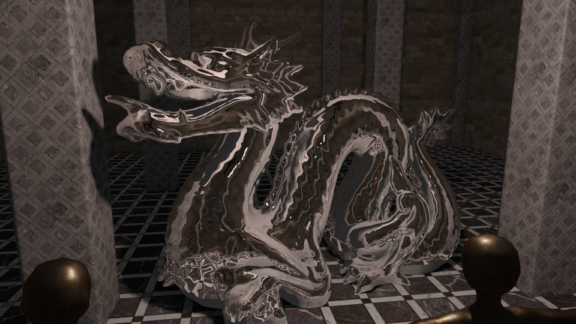
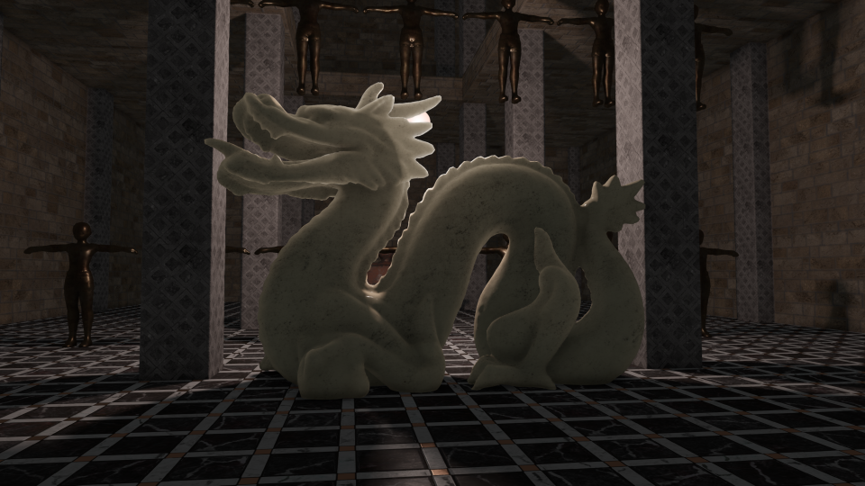

mTec - Efficient Rendering with Distance Fields
========================================
Master Thesis by Michael Mroz

In modern real-time rendering, there is a large focus on producing photorealistic qualities in images. Most techniques used to produce these effects were developed with older, less powerful hardware in mind and sacrifice visual fidelity for fast computation. Now that more and more powerful hardware has been developed, research into alternatives for these well-established techniques has gained traction in the field of computer graphics. Distance fields are one of these contemporary alternatives, and they offer more intuitive approaches to well-established techniques such as ambient occlusion and object shadows.  
This thesis gives an in-depth look into the most common distance field effects and presents a variety of acceleration techniques to show the viability of distance fields for modern game development.

Please refer to the [slides](talk_notes.pdf) from my talk at the University of Pennsylvania for an introduction into the topic of distance fields or my [thesis](SDF_Mroz.pdf) for more in-depth information.

LINK TO VIDEO HERE

Implementation
--------------
The entire code of the mTec renderer can be downloaded from this repo. Please note that Visual Studio and FreeGLUT/GLEW are required to compile an executable.

